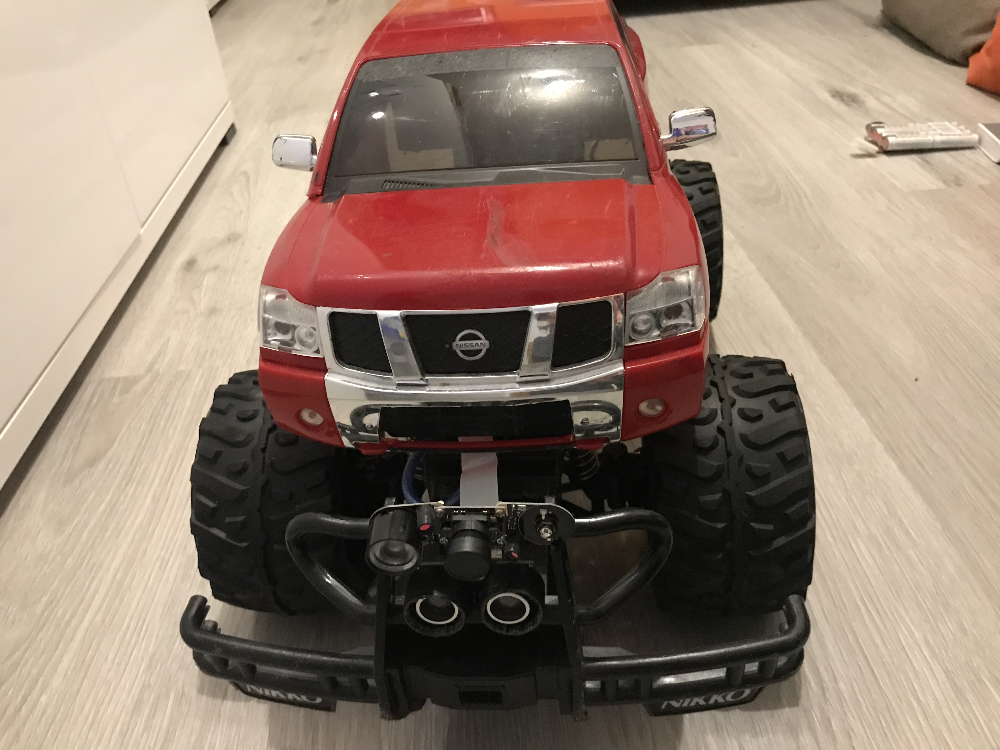
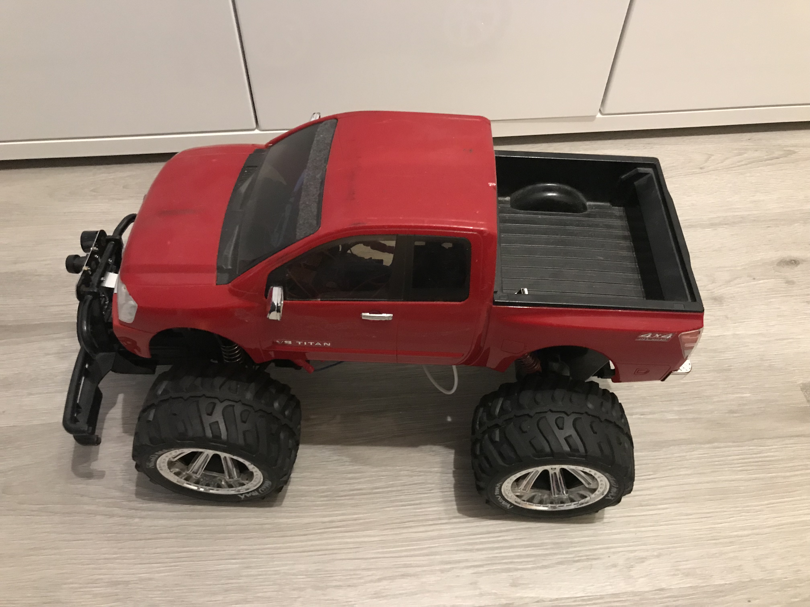
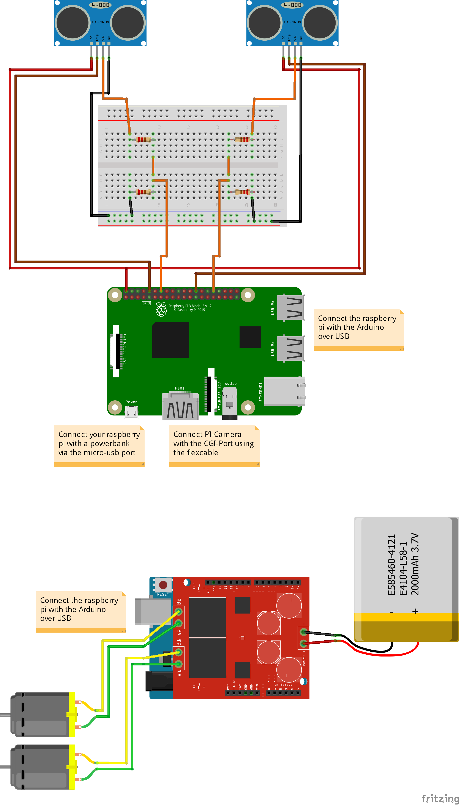
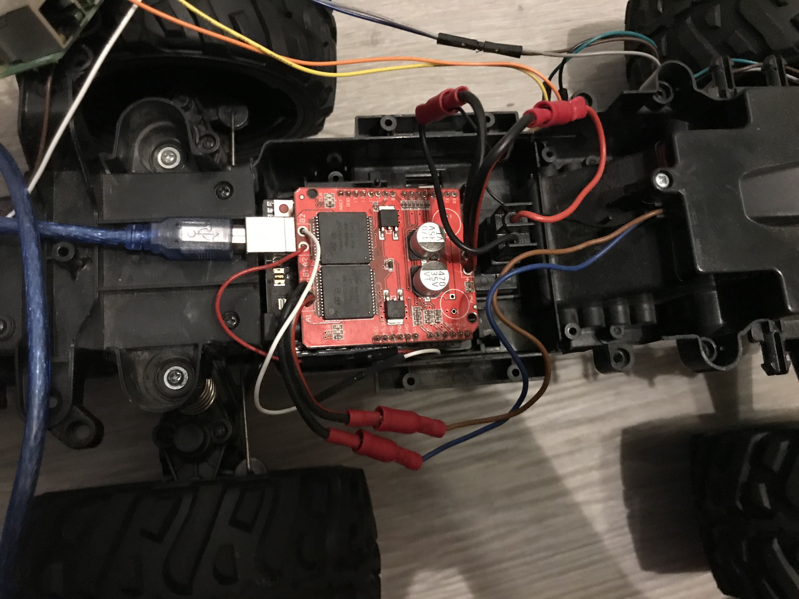
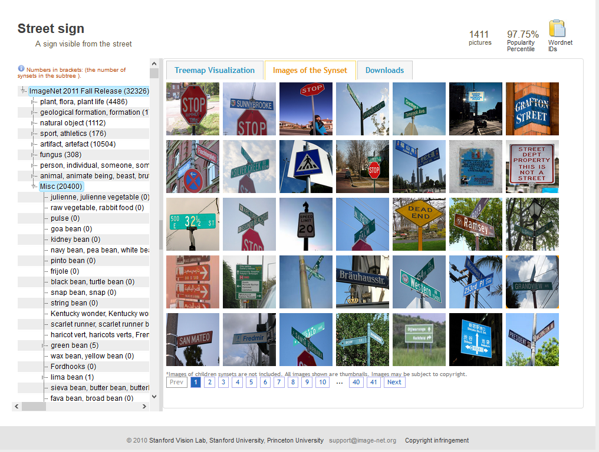

# RC-Car Autonomous

## Work in progress! Please check back later.

In this README you will find a complete installation-guide on how to build your custom autonomous rc-car. Also we will g through the process of using (and training) your own object classifier.
As this tutorial is primary for Windows, most commands have to be slightly edited to run under Linux.
Most parts, except CUDA will also execute well on Mac OS by changing the commands slightly as well.
Later on you can choose to use my pre-trained object detector or to train your own detector.

## Hardware

In the following steps we I will show you my process on how I modified my rc-car.

### Required hardware

Mostly every size of car will do, but you will have to mount an raspberry pi, an arduino (maybe even with motor controller board) and a battery pack with enough output current in or at the outside of the chassis.
In this project I will use a Nikko Nissan Titan rc-car.
As most motors of an rc-car big enough to carry the weight will demand more than 5 Volt to function, you will also need a motor controller (also motor shield) for controlling the motor with your raspberry pi.

<p align="center">
  
  
</p>

For this project you will need the following hardware:
- 1x Rc-car
- 1x Raspberry Pi 3
- 1x Arduino mega
- 1x Power bank for Raspberry pi & Arduino
- 1x Battery pack for motor
- 1x Pi-cam 2
- 2x Ultrasonic sensor HC-SR04
- 1x motor shield
- 2x 330Ω resistor
- 2x 470Ω resistor
- 1x small breadboard or 2x circuit board

Also check whether your rc-car got a brushless motor demanding more than 5 Volt. In this case you will also need to buy a motor controller as the Arduino does not provide more than 5V output.

### Modify your car

#### Remove old electronics

Firstly remove the standard circuit board of the car, but be careful not to damage any electronics we need afterwards like the cables to control the motor or the battery back connector.

#### Overview of the new circuit

<p align="center">
  
</p>

#### Connect Arduino

Connect your motor shield with your Arduino by solder it onto the pins as discribed [here]().
My setup looks like this:
<p align="center">
  
</p>
You can see the Arduino sticking out a bit on the left.

##### 1 Battery pack-connector

Now it's time to connect the battery pack-connector to the shield.
On the picture the battery of the motor is connected on the right side.

##### 2 Servomotor

To controll your rc-car by steering it, connect the two cabels to their corresponding pins on the shield.
The thin white and red wires connect the servomotor in my case.

##### 3 Main motor

Lastly solder your main motor's plus and minus cable onto the pins. Often there is another wire for a ground connection. Connect this wire to the negative terminal of the battery pack-connector.

Now your done with connecting your Arduino.
Before fixing your Arduino, make sure there is enough space for the usb-a cable to connect the Arduino with the pi.


## Software

Now we will look at the software required to enable our rc-car to drive autonomously.
There are two options for you to choose:
1. Build your own object classifier to recognize your signs (recommended)
2. Use my pre-trained classifier

Note: If you want to use the pre-trained classifier, you will have to consider that I trained it on my signs. Therefore it could detect your signs only partly correct or even do not detect them at all.
Nevertheless you could try it out for yourself and if it doesn't work just train your own classifier.


### Create own object classifier (recommended)

Please follow step 1 to 9. When finished, scroll down to section [Setup raspberry pi](https://github.com/mhaid/rc-car_autonomous/blob/master/README.md#setup-raspberry-pi).

#### 1 [optional] Install CUDA

.


#### 2 Download files

Now you have to download the following files:


##### 2a Clone 'mhaid/rc-car_autonomous'-repository

To download this repository as a zip-file click [here](https://github.com/mhaid/rc-car_autonomous/archive/master.zip).
Unpack the file, move it in your 'C:\'-directory and rename the folder from 'rc-car_autonomous-master' to 'rc-car' to shorten commands and make the following process easier.
If you rather like to clone, clone the repository into your 'C:\'-drive and check if it's named the same way as stated above.
```
C:\> git clone https://github.com/mhaid/rc-car_autonomous.git
```


##### 2b Clone 'tensorflow/master'-repository

Download the tensorflow-repository [here](https://github.com/tensorflow/models/archive/master.zip), unpack the zip-file, move it to the following location: 'C:\rc-car\computer\' and rename 'modules-master' to 'master'.
If you clone it, make sure to follow the same steps.
```
C:\> git clone https://github.com/tensorflow/models.git
```


##### 2c Move tmp-files

Now cut all files and folders inside the tmp-directory ('C:\rc-car\computer\tmp') and past them into 'C:\rc-car\computer\models\research\object_detection'.


##### 2d Download 'ssd_mobilenet'-model

"We provide a collection of detection models pre-trained on the COCO dataset, the Kitti dataset, the Open Images dataset, the AVA v2.1 dataset and the iNaturalist Species Detection Dataset. These models can be useful for out-of-the-box inference if you are interested in categories already in those datasets. They are also useful for initializing your models when training on novel datasets." (Quote - [Official model zoo description](https://github.com/tensorflow/models/blob/master/research/object_detection/g3doc/detection_model_zoo.md)).
We will use the ssd_mobilenet_v1_coco model, because of the limited processor-power of the raspberry pi. This model enables us to detect faster, but more inacurate than other slower models.
You can download the model from [here](http://download.tensorflow.org/models/object_detection/ssd_mobilenet_v1_coco_2018_01_28.tar.gz).
When the download finished, extract the file with WinRAR or 7Zip and move the extracted folder into 'C:\rc-car\computer\models\research\object_detection'.


#### 3 Anaconda Virtual Environment

##### 3a Setup Anaconda Environment

<b>Create</b> a new conda <b>environement</b> named 'rc_car'. As tensorflow does currently only support python version 3.5, create the environement with <b>python version 3.5</b>:
```
C:\rc_car> conda create -n rc_car pip python=3.5
```
Now <b>activate</b> the newly created <b>environment</b>:
```
C:\rc_car> activate rc_car
```

##### 3b Install required packages

Inside the conda environment, install <b>'tensorflow'</b> via pip. If you installed CUDA, install <b>'tensorflow-gpu'</b>:
```
(rc_car) C:\rc_car> pip install --ignore-installed --upgrade tensorflow
```
or
```
(rc_car) C:\rc_car> pip install --ignore-installed --upgrade tensorflow-gpu
```
Finally you have to install the following required packages:
```
(rc_car) C:\rc_car> pip install Cython
(rc_car) C:\rc_car> pip install pillow
(rc_car) C:\rc_car> pip install lxml
(rc_car) C:\rc_car> pip install jupyter
(rc_car) C:\rc_car> pip install matplotlib
(rc_car) C:\rc_car> pip install pandas
(rc_car) C:\rc_car> pip install opencv-python
```
Install protobuf:
```
(rc_car) C:\rc_car> conda install -c anaconda protobuf
```

##### 3c Compile Protobufs

Navigate into the 'research' folder located at 'C:\rc_car\computer\models\research'. Run the following script:
```
(rc_car) C:\rc_car\computer\models\research> for %f in (.\object_detection\protos\*.proto) do protoc --python_out=. %f
```
Now you should find a new '.py' file for every '.proto' file in the 'proto'-folder
Note: if you're getting errors while compiling, check out the official [Tensorflow manual](https://github.com/tensorflow/models/blob/master/research/object_detection/g3doc/installation.md#protobuf-compilation).

##### 3d Set the 'PYTHONPATH'

Now set the 'PYTHONPATH' of the anaconda environment:
```
(rc_car) C:\rc_car\computer\models\research> set PYTHONPATH=C:\rc_car\computer\models;C:\rc_car\computer\models\research;C:\rc_car\computer\models\research\slim
```
Note: You will have to set the 'PYTHONPATH' in every new instance of the CMD-Terminal. Closing the terminal will reset the 'PYTHONPATH'-Variable.

##### 3e Run 'setup.py'

Run the following script:
```
(rc_car) C:\rc_car\computer\models\research> python setup.py build
(rc_car) C:\rc_car\computer\models\research> python setup.py install
```

##### 3f Verify installation

To verify your installation, run the jupiter notebook inside the 'object_detection'-folder:
```
(rc_car) C:\rc_car\computer\models\research\object_detection> jupyter notebook object_detection_tutorial.ipynb
```


#### 4 Import and label images

There are two options of gathering the images for your classifier:
4a. Download them from the internet (e.g. google images)
4b. Take your own images
In both cases, make sure there are not less than 200 images to train your classifier on.

##### 4a Download images

There are plenty of options to choose. You could either install an add-on to download pictures directly from <b>google image search</b>, gather your images from a database like [Image Net](http://www.image-net.org/), etc.
<p align="center">
  
</p>
After you downloaded enough pictures, go to step 4c.

##### 4b Take own images

Take your own pictures with your mobile phone, camera or even the pi-cam from your raspberry pi. The images should be scaled down to max. 1080px x 720px (I will explain this step further down), otherwise the training time will increase. Therefore it's not important if you shoot them in 4K or just HD.
I for example took 219 pictures but will increase the count in the future.

##### 4c Resize images

Move all your pictures into the 'images'-directory located in in 'object_detection'. Now run the "resize.py".script:
```
(rc_car) C:\rc-car\computer\models\research\object_detection\images>python resize.py
```
After the script finished, you should see a change in width, height and size of the files.
Complete this step by moving 20% of the images into the test folder. It's best to choose those randomly, because the object classifier should learn to recognize the images across multiple backgrounds and positions of the sign.

##### 4d Label images

To label your test and train images, I suggest to use ['LabelImg'](https://github.com/tzutalin/labelImg) by [tzutalin](https://github.com/tzutalin). Click [here](https://tzutalin.github.io/labelImg/) to get directly to the download page.
After download and installation, open LabelImg, choose the right directory and start drawing the bounding boxes around the objects.

Note: To fasten up the process, activate 'auto save' under the 'edit'-menu entry on the top left of the program. Also you can create a new rectangle by pressing 'w' and navigate by with 'a' and 'd'.

Finally check if all the bounding boxes meet the minimum size by running the 'checkSize.py' script:
```
(rc_car) C:\rc-car\computer\models\research\object_detection\images>python checkSize.py --move
```
All images and their corresponding xml-files which contain one or more bounding boxes smaller than 32px x 32px will be moved to the 'wrong_data'-folder inside 'test' or  'training'.


#### 5 Generate training data

```
(rc_car) C:\rc-car\computer\models\research\object_detection> python xml_to_csv.py
```

Replace the label map section in 'generate_tfrecord.py' with your own classes.
Now issue the following commands:
```
(rc_car) C:\rc-car\computer\models\research\object_detection> python generate_tfrecord.py --csv_input=images\train_labels.csv --image_dir=images\train --output_path=train.record
(rc_car) C:\rc-car\computer\models\research\object_detection> python generate_tfrecord.py --csv_input=images\test_labels.csv --image_dir=images\test --output_path=test.record
```


#### 6 Generate labelmap and configure training

##### 6a Generate labelmap

Edit 'labelmap.pbtxt' by editing the items. If you got more/less than 5 classes, add more/delete some.
Make sure the order of the classes in the 'labelmap.pbtxt' and 'generate_tfrecord.py' are the same.

##### 6b Configure training

Navigate to 'C:\rc-car\computer\models\research\object_detection\samples\configs' and copy 'ssd_mobilenet_v1_coco.config' into the training directory inside 'object_detection' ('C:\rc-car\computer\models\research\object_detection\training').
Open the config file with a text-editor of your choice and make the following changes:
```
L. 9   | num_classes: 5
L. 156 | fine_tune_checkpoint: "D:/rc-car/computer/models/research/object_detection/ssd_mobilenet_v1_coco_2018_01_28/model.ckpt"
L. 175 | input_path: "D:/rc-car/computer/models/research/object_detection/test.record"
L. 177 | label_map_path: "D:/rc-car/computer/models/research/object_detection/training/labelmap.pbtxt"
L. 189 | input_path: "D:/rc-car/computer/models/research/object_detection/train.record"
L. 191 | label_map_path: "D:/rc-car/computer/models/research/object_detection/training/labelmap.pbtxt"
```
Note: Change the 'num_classes'-variable to the number of different objects you want your classifier to detect.


#### 7 Train model

```
(rc_car) C:\rc-car\computer\models\research\object_detection> python train.py --logtostderr --train_dir=training/ --pipeline_config_path=training/faster_rcnn_inception_v2_pets.config
```


#### 8 Export graph and move to 'Raspberry Pi'-folder

The last step of this guide is to export the frozen interface graph (.pb-file). Replace the XXXX in the file name 'model.ckpt-XXXX' with the highest numbered .ckpt file in the training folder. Also check you run this command from the 'object-detection'-folder:
```
(rc_car) C:\rc-car\computer\models\research\object_detection> python export_inference_graph.py --pipeline_config_path training/ssd_mobilenet_v1_coco.config --input_type image_tensor --trained_checkpoint_prefix training/model.ckpt-XXXX --output_directory inference_graph
```

Now you are done teaching your object detector. Well done!
Move your inference_graph.pb in the inference_graph folder into 'C:\rc-car\raspberry_pi\inference_graph' and the labelmap.pbtxt located in the training folder to 'C:\rc-car\raspberry_pi\training'.
Now you a ready to start testing out your object detector in real live!

Please scroll down to section [Setup raspberry pi](https://github.com/mhaid/rc-car_autonomous/blob/master/README.md#setup-raspberry-pi) to continue.


### Use pre-trained model

#### 1 Download files

First of all, you have to download the following files:

##### 1a Clone 'mhaid/rc-car_autonomous'-repository

To download this repository as a zip-file click [here](https://github.com/mhaid/rc-car_autonomous/archive/master.zip).
Unpack the file, move it in your 'C:\'-directory and rename the folder from 'rc-car_autonomous-master' to 'rc-car' to shorten commands and make the following process easier.
If you rather like to clone, clone the repository into your 'C:\'-drive and check if it's named the same way as stated above.
```
C:\> git clone https://github.com/mhaid/rc-car_autonomous.git
```

### Setup raspberry pi

#### 1 Setup raspberry pi

.

#### 2 Move files to raspberry pi

.

### Setup Arduino

#### 1 Upload Arduino script

.


### Test your creation

Now comes the fun part: Finally test out your autonomous rc-car.

Before you start your scripts I will have to provide a short disclaimer:
I am <b>not</b> responsible for any damage or injuries caused by using the scripts and tools provided in this project. This is just a guideline on how you could setup your autonomous rc-car and therefore I do <b>not</b> guarantee that this project will work or will show the expected results.
The use of the provided scripts and tools is at your own risk!
