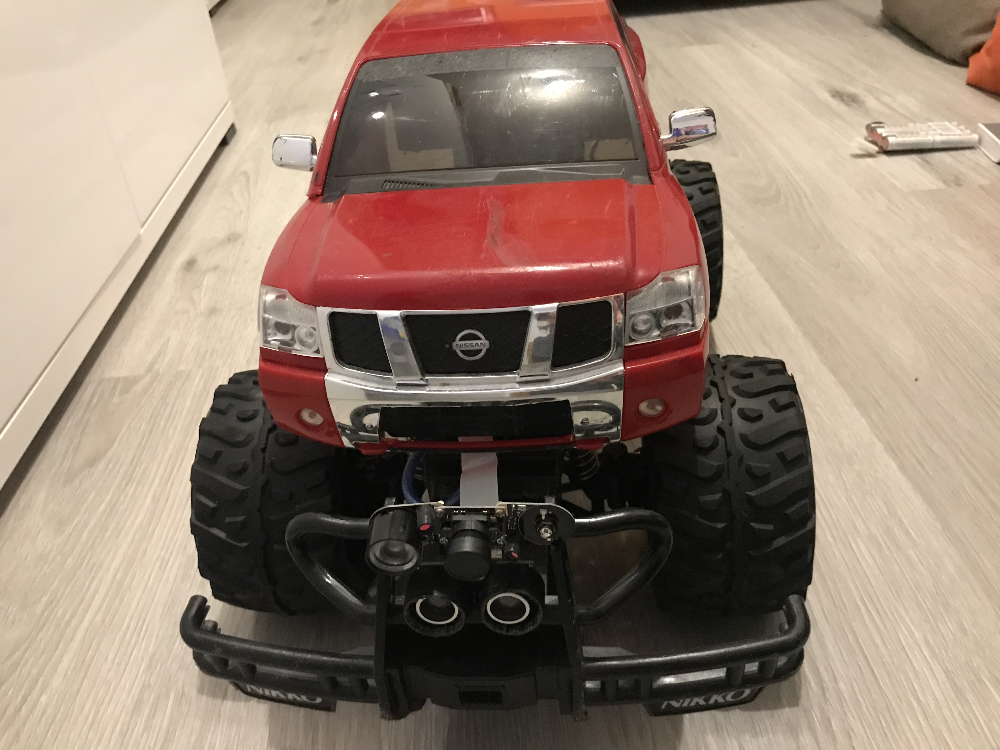
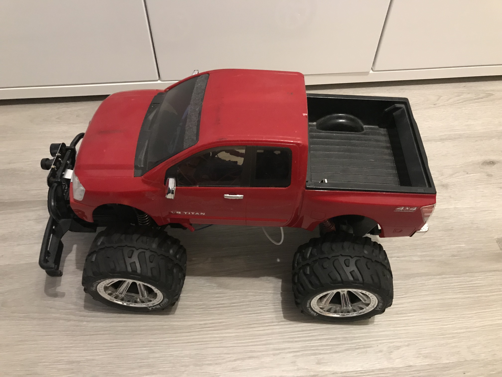
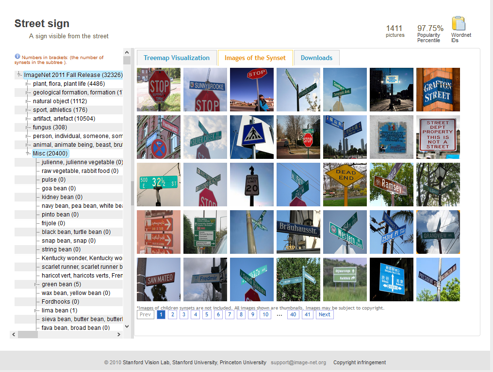

# RC-Car Autonomous

## Work in progress! Please check back later.

In this README you will find a complete installation-guide on how to build your custom autonomous rc-car. Also we will g through the process of using (and training) your own object classifier.
As this tutorial is primary for Windows, most commands have to be slightly edited to run under Linux.
Most parts, except CUDA will also execute well on Mac OS by changing the commands slightly as well.
Later on you can choose to use my pre-trained object detector or to train your own detector.

## Hardware

In the following steps we I will show you my process on how I modified my rc-car.

### Required hardware

Mostly every size of car will do, but you will have to mount an raspberry pi, an arduino (maybe even with motor controller board) and a battery pack with enough output current in or at the outside of the chassis.
In this project I will use a Nikko Nissan Titan rc-car.
As most motors of an rc-car big enough to carry the weight will demand more than 5 Volt to function, you will also need a motor controller (also motor shield) for controlling the motor with your raspberry pi.

<p align="center">
  
  
</p>

For this project you will need the following hardware:
- 1x Rc-car
- 1x Raspberry Pi 3
- 1x Arduino mega
- 1x Power bank for Raspberry pi & Arduino
- 1x Battery pack for motor
- 1x Pi-cam 2
- 2x Ultrasonic sensor HC-SR04
- 1x Motor driver VNH2SP30
- 2x 330Ω resistor
- 2x 470Ω resistor
- 1x small breadboard or 2x circuit board

### Modify your car

#### Remove old electronics

Firstly remove the standard circuit board of the car, but be careful not to damage any electronics we will need afterwards like the control-cables of the motor or the battery back connector.

#### Overview of the new circuit

<p align="center">
  
</p>

#### Connect Arduino

Connect your motor shield with your Arduino by solder it onto the pins as described [here](http://www.gunook.com/anleitung-fur-monster-motor-shield-vnh2sp30/).
My setup looks like this:
<p align="center">
  
</p>

##### 1 Battery pack-connector

Now it's time to connect the battery pack-connector to the shield.
On the picture the battery of the motor is connected on the right side.

##### 2 Servomotor

To enable steering, connect the two cables to their corresponding pins on the shield.
The thin white and red wires connect the servomotor in my case. 

##### 3 Main motor

Now solder your main motors plus and minus cable onto the pins. Often there is another wire for a ground connection. Connect the ground wire to the negative terminal of the battery pack-connector.

Now you’re done with connecting your Arduino.
Before mounting your Arduino to the car, make sure there is enough space for the USB-A to USB -B cable to connect the Arduino with the pi.

#### Connect raspberry pi


.

##### 1 Ultrasonic sensors

.

##### 2 Pi Camera

.

##### Connect Arduino and Raspberry pi

Connect the Arduino with the pi's USB-port, by using the USB-A to USB-B cable shipped with the Arduino.
We need this connection to power the Arduino and send commands over the USB interface.


## Software

Now we will look at the software required to enable our rc-car to drive autonomously.
There are two options for you to choose:
1. Build your own object classifier to recognize your signs (recommended)
2. Use my pre-trained classifier

Note: If you want to use the pre-trained classifier, you will have to consider that I trained it on my signs. Therefore it could detect your signs only partly correct or even do not detect them at all.
Nevertheless you could try it out for yourself and if it doesn't work just train your own classifier.


### Create own object classifier (recommended)

Please follow step 1 to 9. When finished, scroll down to section [Setup raspberry pi](https://github.com/mhaid/rc-car_autonomous/blob/master/README.md#setup-raspberry-pi).

#### 1 [optional] Install CUDA

.


#### 2 Download files

Now you have to download the following files:


##### 2a Clone 'mhaid/rc-car_autonomous'-repository

To download this repository as a zip-file click [here](https://github.com/mhaid/rc-car_autonomous/archive/master.zip).
Unpack the file, move it in your 'C:\\'-directory and rename the folder from 'rc-car_autonomous-master' to 'rc-car' to shorten commands and make the following process easier.
If you rather like to clone, clone the repository into your 'C:\\'-drive and check if it's named the same way as stated above.
```
C:\> git clone https://github.com/mhaid/rc-car_autonomous.git
```


##### 2b Clone 'tensorflow/master'-repository

Download the TensorFlow-repository [here](https://github.com/tensorflow/models/archive/master.zip), unpack the zip-file, move it to the following location: 'C:\rc-car\computer\' and rename 'modules-master' to 'modules'.
If you clone it, make sure to follow the same steps.
```
C:\> git clone https://github.com/tensorflow/models.git
```


##### 2c Move tmp-files

Now cut all files and folders inside the tmp-directory ('C:\rc-car\computer\tmp') and past them into 'C:\rc-car\computer\models\research\object_detection'.


##### 2d Download 'ssd_mobilenet'-model

"We provide a collection of detection models pre-trained on the COCO dataset, the Kitti dataset, the Open Images dataset, the AVA v2.1 dataset and the iNaturalist Species Detection Dataset. These models can be useful for out-of-the-box inference if you are interested in categories already in those datasets. They are also useful for initializing your models when training on novel datasets." ([Official model zoo description](https://github.com/tensorflow/models/blob/master/research/object_detection/g3doc/detection_model_zoo.md)).
Because of the limited processor-power of the raspberry pi, we will use the ssd_mobilenet_v1_coco model. This model enables us to detect faster, but more inaccurate than most other models.
You can download the model from [here](http://download.tensorflow.org/models/object_detection/ssd_mobilenet_v1_coco_2018_01_28.tar.gz).
When the download finished, extract the file with WinRAR or 7Zip and move the extracted folder into 'C:\rc-car\computer\models\research\object_detection'.


#### 3 Anaconda Virtual Environment

##### 3a Setup Anaconda Environment

<b>Create</b> a new Anaconda <b>environment</b> named 'rc-car'. As TensorFlow does currently only support python version 3.5, create the environment with <b>python version 3.5</b>:
```
C:\rc-car> conda create -n rc-car pip python=3.5
```
Now <b>activate</b> the newly created <b>environment</b> to run the commands inside the environment:
```
C:\rc-car> activate rc-car
```

##### 3b Install required packages

Inside the conda environment, install <b>'TensorFlow'</b> via pip. If you installed CUDA, install <b>'tensorflow-gpu'</b>:
```
(rc-car) C:\rc-car> pip install --ignore-installed --upgrade tensorflow
```
or
```
(rc-car) C:\rc-car> pip install --ignore-installed --upgrade tensorflow-gpu
```
Finally you have to install the following required packages:
```
(rc-car) C:\rc-car> pip install Cython
(rc-car) C:\rc-car> pip install pillow
(rc-car) C:\rc-car> pip install lxml
(rc-car) C:\rc-car> pip install jupyter
(rc-car) C:\rc-car> pip install matplotlib
(rc-car) C:\rc-car> pip install pandas
(rc-car) C:\rc-car> pip install opencv-python
```
Install protobuf:
```
(rc-car) C:\rc-car> conda install -c anaconda protobuf
```

##### 3c Compile Protobufs

Navigate into the 'research' folder located at 'C:\rc-car\computer\models\research'. Run the following script:
```
(rc-car) C:\rc-car\computer\models\research> for %f in (.\object_detection\protos\*.proto) do protoc --python_out=. %f
```
Now you should find a new '.py' file for every '.proto' file in the 'proto'-folder
Note: if you're getting errors while compiling, check out the official [TensorFlow manual](https://github.com/tensorflow/models/blob/master/research/object_detection/g3doc/installation.md#protobuf-compilation).

##### 3d Set the 'PYTHONPATH'

Now set the 'PYTHONPATH' of the anaconda environment:
```
(rc-car) C:\rc-car\computer\models\research> set PYTHONPATH=C:\rc-car\computer\models;C:\rc-car\computer\models\research;C:\rc-car\computer\models\research\slim
```
Note: You will have to set the 'PYTHONPATH' in every new instance of the CMD-Terminal. Closing the terminal will reset the 'PYTHONPATH'-Variable.

##### 3e Run 'setup.py'

Run the following script:
```
(rc-car) C:\rc-car\computer\models\research> python setup.py build
(rc-car) C:\rc-car\computer\models\research> python setup.py install
```

##### 3f Verify installation

To verify your installation, run the Jupiter notebook inside the 'object_detection'-folder:
```
(rc-car) C:\rc-car\computer\models\research\object_detection> jupyter notebook object_detection_tutorial.ipynb
```


#### 4 Import and label images

There are two options of gathering the images for your classifier:<br>
4a. Download them from the internet (e.g. google images)<br>
4b. Take your own images<br>
In both cases, make sure there are not less than 200 images to train your classifier on.

##### 4a Download images

There are plenty of options to choose. You could either install an add-on to download pictures directly from <b>google image search</b>, gather your images from a database like [Image Net](http://www.image-net.org/), etc.<br>
For Firefox, you can install the ['Google Images Downloader' Add-on](https://addons.mozilla.org/de/firefox/addon/google-images-downloader/); for Chrome the ['Canvas' Add-on](https://chrome.google.com/webstore/detail/canvas-powerful-google-im/bfncneeboblpajkpienladgdmfdkpefg).
<p align="center">
  
</p>
After you downloaded enough pictures, go to step 4c.

##### 4b Take own images

Take your own pictures with your mobile phone, camera or even the pi-cam from your raspberry pi. The images should be scaled down to max. 1080px x 720px (I will explain this step further down), otherwise the training time will increase. Therefore it's not important if you shoot them in 4K or just HD.
I for example took 219 pictures but will increase the amount in the future.

##### 4c Resize images

Move all your pictures into the 'images'-directory located in in 'object_detection\training_input'. Now run the "resize.py".script:
```
(rc-car) C:\rc-car\computer\models\research\object_detection\training_input\images>python resize.py
```
After the script finished, you should see a change in width, height and size of the files.
Complete this step by moving 20% of the images into the test folder. It's best to choose those randomly, because the object classifier should learn to recognize the images across multiple backgrounds and positions of the signs.
Move the other 80% into the train directory.

##### 4d Label images

To label your test and train images, I suggest to use ['LabelImg'](https://github.com/tzutalin/labelImg) by [tzutalin](https://github.com/tzutalin). Click [here](https://tzutalin.github.io/labelImg/) to get directly to the download page.
After download and installation, open LabelImg, choose the right directory and start drawing the bounding boxes around the objects.

Note: To fasten up the process, activate 'auto save' under the 'edit'-menu entry on the top left of the program. Also you can create a new rectangle by pressing 'w' and navigate with 'a' and 'd'.

Finally check if all the bounding boxes meet the minimum size by running the 'checkSize.py' script:
```
(rc-car) C:\rc-car\computer\models\research\object_detection\training_input\images>python checkSize.py --move
```
All images and their corresponding xml-files which contain one or more bounding boxes smaller than 32px x 32px will be moved to the 'wrong_data'-folder inside the 'test' or  'training' folder.


#### 5 Generate training data

Redirect to the 'training_input' folder and run the following command to convert the xml-files to usable csv-files.
```
(rc-car) C:\rc-car\computer\models\research\object_detection\training_input> python xml_to_csv.py
```

Replace the label map section in 'generate_tfrecord.py' with your own classes.
Now issue the following commands:
```
(rc-car) C:\rc-car\computer\models\research\object_detection\training_input> python generate_tfrecord.py --csv_input=images\train_labels.csv --image_dir=images\train --output_path=data\train.record
(rc-car) C:\rc-car\computer\models\research\object_detection\training_input> python generate_tfrecord.py --csv_input=images\test_labels.csv --image_dir=images\test --output_path=data\test.record
```


#### 6 Generate label map and configure training

##### 6a Generate label map

Edit 'label_map.pbtxt' by editing the items. If you got more/less than 5 classes, add more/delete some.
Also make sure the order of the classes in the 'label_map.pbtxt' and 'generate_tfrecord.py' match up.

##### 6b Configure training

Navigate to 'C:\rc-car\computer\models\research\object_detection\samples\configs' and copy 'ssd_mobilenet_v1_coco.config' into the 'training_input' directory inside 'object_detection' ('C:\rc-car\computer\models\research\object_detection\training_input').
Open the config file with a text-editor of your choice and make the following changes:
```
L. 9   | num_classes: 5
L. 156 | fine_tune_checkpoint: "D:/rc-car/computer/models/research/object_detection/ssd_mobilenet_v1_coco_2018_01_28/model.ckpt"
L. 175 | input_path: "D:/rc-car/computer/models/research/object_detection/train_input/data/test.record"
L. 177 | label_map_path: "D:/rc-car/computer/models/research/object_detection/train_input/label_map.pbtxt"
L. 189 | input_path: "D:/rc-car/computer/models/research/object_detection/train_input/data/train.record"
L. 191 | label_map_path: "D:/rc-car/computer/models/research/object_detection/train_input/label_map.pbtxt"
```
Note: Change the 'num_classes'-variable to the number of different objects you want your classifier to detect.


#### 7 Train model

```
(rc-car) C:\rc-car\computer\models\research\object_detection> python train.py --logtostderr --train_dir=training_output/ --pipeline_config_path=training_input/ssd_mobilenet_v1_coco.config
```


#### 8 Export graph and move to 'Raspberry Pi'-folder

The last step of this guide is to export the frozen interface graph (.pb-file). Replace the XXXX in the file name 'model.ckpt-XXXX' with the highest numbered .ckpt file in the training folder. Also check you run this command from the 'object-detection'-folder:
```
(rc-car) C:\rc-car\computer\models\research\object_detection> python export_inference_graph.py --pipeline_config_path training_input/ssd_mobilenet_v1_coco.config --input_type image_tensor --trained_checkpoint_prefix training_output/model.ckpt-XXXX --output_directory training_output
```

Now you are done teaching your object detector. Well done!
Move your 'frozen_inference_graph.pb' in the 'training_output' folder to 'C:\rc-car\raspberry_pi\detector' and the 'label_map.pbtxt' located in the 'training_input' folder to 'C:\rc-car\raspberry_pi\detector'.
Now you a ready to start testing out your object detector in real life!

Please scroll down to section [Setup raspberry pi](https://github.com/mhaid/rc-car_autonomous/blob/master/README.md#setup-raspberry-pi) to continue.


### Use pre-trained model

#### 1 Download files

First of all, you have to download the following files:

##### 1a Clone 'mhaid/rc-car_autonomous'-repository

To download this repository as a zip-file click [here](https://github.com/mhaid/rc-car_autonomous/archive/master.zip).
Unpack the file, move it in your 'C:\\'-directory and rename the folder from 'rc-car_autonomous-master' to 'rc-car' to shorten commands and make the following process easier.
If you rather like to clone, clone the repository into your 'C:\\'-drive and check if it's named the same way as stated above.
```
C:\> git clone https://github.com/mhaid/rc-car_autonomous.git
```

### Raspberry Pi

Connect your raspberry pi to a screen via HDMI and open a new terminal or use SSH (I recommend using putty) to connect remotely.

#### 1 Download files

##### Download rc-car repository

Navigate into the '/home/pi/' folder and clone the 'mhaid/rc-car_autonomous' repository:
```
cd /home/pi/
git clone https://github.com/mhaid/rc-car_autonomous.git
```
Rename the folder to 'rc-car':
```
mv /home/pi/rc-car_autonomous /home/pi/rc-car
```

##### Download TensorFlow models

cd into the 'raspberry_pi' folder in '/home/pi/rc-car/raspberry_pi/' and clone the models folder:
```
cd /home/pi/rc-car/raspberry_pi/
git clone --recurse-submodules https://github.com/tensorflow/models.git
```

Now move all files and folders from '/home/pi/rc-car/raspberry_pi/tmp' to /home/pi/rc-car/raspberry_pi/models/research/object_detection':
```
pi@raspberrypi:~/rc-car/raspberry_pi $ mv tmp/detector models/research/object_detection/detector
pi@raspberrypi:~/rc-car/raspberry_pi $ mv tmp/camera_od_client.py models/research/object_detection
```

#### 2 Setup Raspberry Pi

##### Update Raspberry Pi

Firstly, your Raspberry Pi has to be up-to-date. Execute this command:

```
sudo apt-get update
sudo apt-get dist-upgrade
```
Note: We are using 'dist-upgrade' instead of 'upgrade' to resolve any dependency errors. By just using 'upgrade', the pi would not install any new or remove any existing packages and therefore does not resolve dependency issues.<br>

Depending on when you lastly updated the Raspberry, updating can take a minute and a couple of hour.

##### Install TensorFlow for ARM

Now we need to install TensorFlow.<br>
Make sure the following packages are installed by running the following commands:
```
sudo apt install python3-dev python3-pip
sudo apt install libatlas-base-dev
```

When done, install TensorFlow with this command and verify the installation:
```
pip3 install --upgrade tensorflow
python3 -c "import tensorflow as tf; tf.enable_eager_execution(); print(tf.reduce_sum(tf.random_normal([1000, 1000])))"
```

##### Install required libraries

```
sudo apt-get install protobuf-compiler python-pil python-lxml python-tk
pip3 install Cython
pip3 install contextlib2
pip3 install jupyter
pip3 install matplotlib
pip3 install opencv-python
```
Note: If you experience any errors installing protobuf, try the [manual installation](https://github.com/tensorflow/models/blob/master/research/object_detection/g3doc/installation.md#Manual-protobuf-compiler-installation-and-usage).

##### Compile protobuf

From /home/pi/rc-car/raspberry_pi/models/research/ execute the following command:
```
protoc object_detection/protos/*.proto --python_out=.
```
Now you should find a new '.py' file for every '.proto' file in the 'proto'-folder
Note: if you're getting errors while compiling, check out the official [TensorFlow manual](https://github.com/tensorflow/models/blob/master/research/object_detection/g3doc/installation.md#protobuf-compilation).

##### Set 'PYTHONPATH'

To set the 'PYTHONPATH' run the following command from the '/home/pi/rc-car/raspberry_pi/models/research/' directory:
```
pi@raspberrypi:~/rc-car/raspberry_pi/models/research/ $ export PYTHONPATH=$PYTHONPATH:`pwd`:`pwd`/slim
```

If you want to automatically set the path in every instance of the terminal, we need to edit the .bashrc file:
```
sudo nano ~/.bashrc
```
Move to the bottom of the file and add this last line:
```
export PYTHONPATH=$PYTHONPATH:/home/pi/rc-car/raspberry_pi/models/research:/home/pi/rc-car/raspberry_pi/models/research/slim
```

##### Run setup.py

Navigate into the 'research' folder (/home/pi/rc-car/raspberry_pi/models/research/) and run these commands:
```
python3 setup.py build
python3 setup.py test
```
Note: If you get any errors because of the 'echo' command, you have to change those lines to be compatile to python3

##### Download SSDLite-MobileNet

Now we need to download the detection model from [TensorFlows detection model zoo](https://github.com/tensorflow/models/blob/master/research/object_detection/g3doc/detection_model_zoo.md).
Navigate into the 'object_detection' folder (/home/pi/tensorflow1/models/research/object_detection) and run these commands to download and extract the package:

```
wget http://download.tensorflow.org/models/object_detection/ssd_mobilenet_v1_coco_2018_01_28.tar.gz
tar -xzf ssd_mobilenet_v1_coco_2018_01_28.tar.gz
```

##### Enable Camera Interface

To enable to Camera Interface graphically, open the Raspian-menu on the top left, click on 'Preferences' and 'Raspberry Pi Configuration'. In the new 'Raspberry Pi Configuration' window, switch to the 'Interfaces' tab and check the toggle button 'Enabled' next to the camera.

For everyone using SSH or just wanting to use the terminal, execute the raspi-config command:
```
sudo raspi-config
```
Now choose the '5. Interfaces' menu and 'P1. Camera'.
Choose 'Yes' if you get asked whether you want to enable the Camera Interface and 'No' if it asks to disable it.
Now hit 'Finish' and you’re done!

#### Test object detector


```
pi@raspberrypi:~/rc-car/raspberry_pi/models/research/object_detector $ python3 builders/model_builder_test.py
```

```
pi@raspberrypi:~/rc-car/raspberry_pi/models/research/object_detector $ python3 camera_od_client.py
```

### Setup Arduino

#### 1 Upload Arduino script

.


### Test your creation

Now comes the fun part: Finally test out your awesome autonomous rc-car.

Before you start your scripts I will have to provide a short disclaimer:
I am <b>not</b> responsible for any damage or injuries caused by using the scripts and tools provided in this project. This is just a guideline on how you could setup your autonomous rc-car and therefore I do <b>not</b> guarantee that this project will work or will show the expected results.
The use of the provided scripts and tools is at your own risk!
